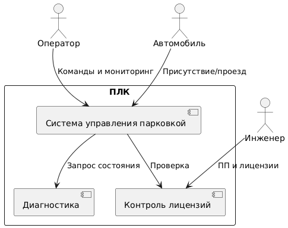
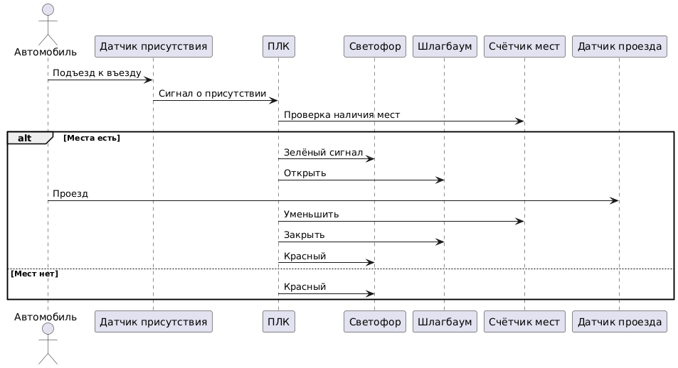
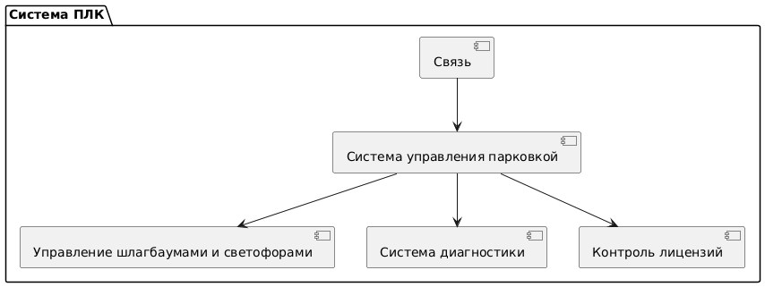

# 🔧 ПЛК в составе АСУ ТП ТЭЦ

**Проект:** разработка и моделирование программируемого логического контроллера (ПЛК), обеспечивающего управление технологическим оборудованием теплоэлектроцентрали (ТЭЦ) в составе автоматизированной системы управления технологическим процессом (АСУ ТП).

Контроллер взаимодействует с исполнительными механизмами и датчиками, обрабатывает сигналы, выполняет команды, заданные прикладной программой, и передаёт данные в вышестоящую систему управления.

---

## 📘 Назначение и применение

Данный ПЛК предназначен для:
- Получения сигналов от датчиков и технологического оборудования;
- Управления исполнительными механизмами по логике прикладной программы;
- Взаимодействия с АСУ ТП и оператором через интерфейсы связи;
- Гибкой настройки технологических процессов через смену прикладной логики без изменения системного ПО.

---

## 🛡 Ценности, угрозы и безопасность

| № | Ценность                    | Нежелательные события                                           | Комментарий                                         |
|---|-----------------------------|------------------------------------------------------------------|-----------------------------------------------------|
| 1 | Сигналы от оборудования     | Потеря, искажение, подделка сигнала                             | Нарушение управления процессом                      |
| 2 | Команды от АСУ              | Задержка, искажение, дублирование                              | Опасные действия или нарушение технологического режима |
| 3 | Прикладная программа        | Подмена, несанкционированный доступ                            | Угроза целостности и безопасности процессов         |
| 4 | Система лицензирования      | Запуск несертифицированной логики                             | Нарушение промышленного регламента и стандартов     |

---

## 👤 Роли пользователей

| Роль            | Назначение                                                    | Комментарий                             |
|-----------------|---------------------------------------------------------------|-----------------------------------------|
| Оператор АСУ ТП | Контроль и наблюдение за оборудованием, ручное управление     | Через АРМ (интерфейс АСУ)               |
| Инженер         | Разработка и загрузка прикладной программы, лицензирование    | Требует доступ и проверку лицензии      |
| Техподдержка    | Диагностика и обслуживание оборудования                       | Только чтение состояния и журналов      |

---

## ⚙️ Основные сценарии

### ✅ Базовый сценарий: автоматическое управление оборудованием
1. ПЛК получает сигнал от датчика.
2. Прикладная программа анализирует входные данные.
3. На основе логики выдаётся команда исполнительному механизму.
4. ПЛК фиксирует выполнение, передаёт информацию в АСУ ТП.

### ⚠️ Дополнительные сценарии
- **Ручной режим:** оператор даёт команду через АРМ.
- **Диагностика:** система выявляет неисправность, сигнализирует в АСУ.
- **Обновление ПП:** инженер загружает новую прикладную программу через защищённый канал, проверяется лицензия.

---

## 🏗 Архитектура системы

**Подсистемы ПЛК:**
1. **Связь** — интерфейс между АСУ ТП и ПЛК.
2. **Логика управления (ПП)** — основная логика обработки сигналов и команд.
3. **Управление исполнительными механизмами** — подача сигналов на оборудование.
4. **Диагностика** — контроль состояния и самопроверка.
5. **Контроль лицензий** — проверка легитимности прикладной программы.

---

## 📷 Диаграммы

### Контекстная диаграмма

### Базовый сценарий

### Архитектура

---

## 📌 Примечания

- Проект моделирует архитектуру промышленного ПЛК в составе АСУ ТП.
- Все схемы могут быть адаптированы под реальные производственные задачи.
- Пример создан в учебных целях, но приближен к промышленной практике.

---

## 🛠 Лицензия

[MIT License](LICENSE)
